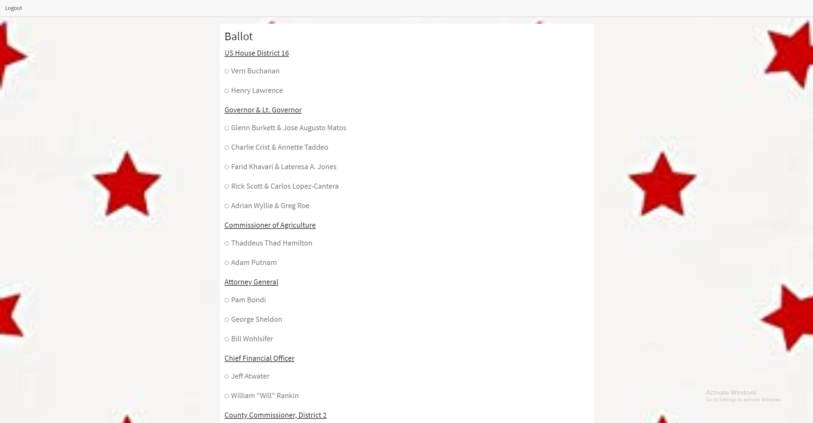

# Online Voting App

## Description:
This voting app is a proof of concept application since we could not be provided with DMV information. Our motivation is the current state of the world with Covid and the controversy surrounding mail-in ballots.

## Table of Contents:

* [Installation](#installation)
* [Information](#Information)
* [License](#license)
* [Contributing](#contributing)
* [Tests](#Tests)
* [Questions](#questions)

## Installation

To install all necessary dependencies, run the following command:

" npm i "

## Information

When you create an account there are strict rules in place. You must vote from home (your location must match your zip code on file), you must have a valid state id, you must have your voter registration number, and your information must be on file with DMV and must match. If you do not pass all of the criteria, you will be unable to vote online.

## License

This project is licensed under the MIT license.

## Contributing

To contribute to this repo, create a pull request

## Tests

To run tests on the repo, run the following command:

" npm test "

## Questions

If you have any questions or comments about the repo, please feel free to email me at ydoc118@gmail.com,
or visit my GitHub to see more of my work at [Ydoc118](https://github.com/Ydoc118)

## Image of Repo

     